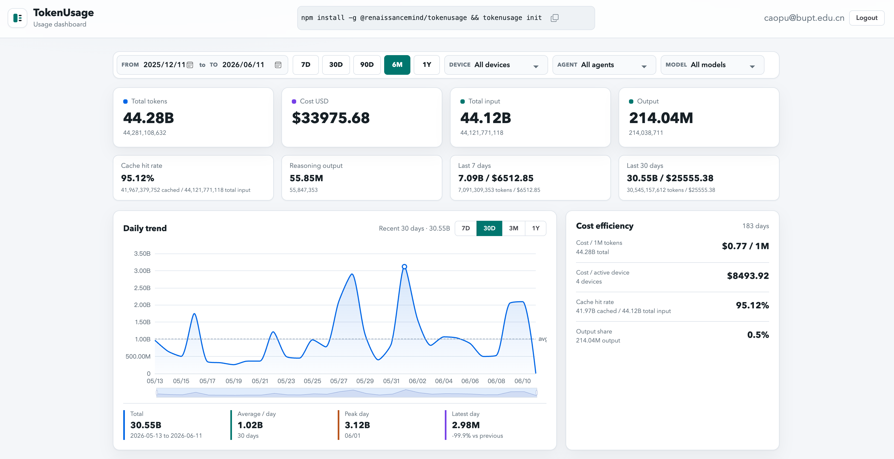

# TokenUsage

## One-command setup

```bash
npm install -g @renaissancemind/tokenusage && tokenusage init
```

Dashboard: https://tokenusage.renaissancemind.ai/



**Language:** English | [简体中文](docs/i18n/README.zh-CN.md) | [繁體中文](docs/i18n/README.zh-TW.md) | [日本語](docs/i18n/README.ja.md) | [한국어](docs/i18n/README.ko.md) | [Español](docs/i18n/README.es.md) | [Türkçe](docs/i18n/README.tr.md) | [Русский](docs/i18n/README.ru.md)

> Private, local-first token accounting for the AI agents you actually use.


[Features](#features) - [Install](#install) - [Quick Start](#quick-start) - [Commands](#commands) - [Configuration](#configuration) - [Development](#development)

TokenUsage is an installable local collector for multi-device AI-agent usage accounting. It scans local Codex, Claude Code, Gemini CLI, OpenCode, Kimi CLI, and Qwen Code usage data, aggregates token counts into UTC half-hour buckets by agent and model, calculates known costs, and uploads only changed usage metadata to a TokenUsage server.

Prompts and responses stay on your machine. Uploaded payloads contain counts, model names, bucket timestamps, pricing status, and optional device metadata.

## Preview

```bash
$ tokenusage status
TokenUsage status
Config: /Users/alice/.tokenusage/config.json
Server: https://tokenusage.renaissancemind.ai
Device: dev_...
Token: set (device)
Remote: linked
Local events: 1842
Local buckets: 37
Source codex: found (219 files) /Users/alice/.codex/sessions
Source claude: found (64 files) /Users/alice/.claude/projects
Source gemini: missing (0 files) /Users/alice/.gemini/tmp
Source opencode: found (1 files) /Users/alice/.local/share/opencode/opencode.db
Home: /Users/alice/.tokenusage
```

## Features

- 🔐 **Local-first collection** - reads agent logs locally and uploads metadata only.
- 🤖 **Multi-agent support** - Codex, Claude Code, Gemini CLI, OpenCode, Kimi CLI, and Qwen Code.
- 📊 **Half-hour UTC buckets** - keeps local usage detail while dashboards can still summarize by day.
- 💸 **Cost-aware accounting** - separates fresh input, cached input, cache creation, output, and reasoning output tokens.
- 🧾 **Unpriced model visibility** - unknown models are counted and marked as `unpriced` instead of silently disappearing.
- 🔁 **Incremental automatic sync** - installs a 10-minute macOS `launchd` or Linux systemd user timer and uploads only new or changed buckets after the initial backfill.
- 🔑 **Device login or API key upload** - supports browser device linking and `read_write` API tokens.
- 🛠️ **Self-host friendly** - point the CLI at any compatible TokenUsage server URL.

## Supported Sources

| Source | Local data read | Notes |
| --- | --- | --- |
| Codex | `~/.codex/sessions/**/rollout-*.jsonl` and archived session JSONL | Parses local rollout token events. |
| Claude Code | `~/.claude/projects/**/*.jsonl` | Parses project JSONL usage data. |
| Gemini CLI | `~/.gemini/tmp/**/chats/session-*.json` | Parses Gemini session JSON files. |
| OpenCode | `~/.local/share/opencode/opencode.db` | Requires `sqlite3` on `PATH`. |
| Kimi CLI | `~/.kimi/sessions/*/*/wire.jsonl` | Reads `StatusUpdate.token_usage` rows and `~/.kimi/config.json` model metadata. |
| Qwen Code | `~/.qwen/projects/*/chats/*.jsonl` | Reads assistant `usageMetadata` rows. |

TokenUsage intentionally does not upload source file paths, session IDs, prompts, or responses.

## Install

TokenUsage requires Node.js 20 or newer.

```bash
npm install -g @renaissancemind/tokenusage
```

If you want OpenCode support, make sure `sqlite3` is available:

```bash
sqlite3 --version
```

From a local checkout before npm publication:

```bash
npm install
npm install -g .
```

`npm install -g .` runs the package `prepare` script, so the TypeScript CLI is compiled before npm links `dist/cli.js`.

## Quick Start

### 1. Link this machine

```bash
tokenusage login
```

By default, `login` uses `https://tokenusage.renaissancemind.ai`. It prints a verification URL and user code, opens the browser when possible, stores the approved device token in `~/.tokenusage/config.json`, then runs one initial `sync`.

To use a self-hosted server:

```bash
tokenusage login --server-url http://127.0.0.1:8787
```

To link the machine without the initial upload:

```bash
tokenusage login --no-sync
```

### 2. Check what will be scanned

```bash
tokenusage status
```

`status` shows local source paths, parsed event counts, bucket counts, unpriced bucket counts, config location, and remote auth status when a token is configured.

### 3. Sync usage

```bash
tokenusage sync
```

`sync` scans local logs, aggregates half-hour usage buckets, uploads only new or changed buckets, records a sync heartbeat, and reports parsed events plus uploaded buckets. The local upload ledger lives in `~/.tokenusage/sync-state.json`.

### 4. Install automatic sync

```bash
tokenusage init
```

`init` writes `~/.tokenusage/config.json`, installs automatic sync every 10 minutes on macOS or Linux, then starts the browser device-link flow unless a token already exists.

## API Token Mode

Browser device linking is convenient for personal machines. For servers, CI-style machines, or scripted installs, use a `read_write` API key from the TokenUsage server dashboard:

```bash
tokenusage init --server-url https://tokenusage.renaissancemind.ai --api-token tu_api_...
```

Only `read_write` keys can upload usage. `read_only` keys are for dashboards, API reads, and public heatmap embeds; the CLI rejects read-only keys during `init` and `login`.

## Commands

```bash
tokenusage init --server-url https://tokenusage.renaissancemind.ai
tokenusage login --server-url https://tokenusage.renaissancemind.ai
tokenusage login --server-url https://tokenusage.renaissancemind.ai --api-token tu_api_...
tokenusage sync
tokenusage status
tokenusage update [--source @renaissancemind/tokenusage@latest|/path/to/TokenUsage]
tokenusage logout
```

| Command | What it does |
| --- | --- |
| `init` | Writes config, installs auto-sync, and optionally starts login. |
| `login` | Links a browser-approved device token or stores a validated upload API token, then runs an initial sync unless `--no-sync` is set. |
| `sync` | Parses local usage, builds UTC half-hour buckets, uploads new or changed buckets, and updates `lastSyncAt`. |
| `status` | Prints local config, source availability, bucket counts, auth status, and unpriced models. |
| `update` | Reinstalls the global package and refreshes the auto-sync scheduler. |
| `logout` | Removes local upload tokens while keeping non-secret config. |

## Pricing Model

TokenUsage calculates costs locally before upload.

- Built-in pricing covers known Codex, Claude, Gemini, OpenCode, and cc-switch-inspired
  third-party coding/provider model IDs including DeepSeek, Kimi K2, MiniMax, GLM,
  Qwen, Doubao, StepFun, MiMo, Grok, Mistral, and Cohere.
- Unknown models are still counted and uploaded with `pricing_status: "unpriced"`.
- Unpriced buckets record cost as `$0.000000` so token totals remain accurate and cost gaps stay visible.
- Cost calculation follows ccusage-style token accounting: fresh input, output, cache read, cache creation, optional 200k+ pricing tiers, and 1-hour cache creation at 2x input price when a source reports cache creation duration.
- For Codex and Gemini, cached input can be included in reported input and is separated before cost calculation to avoid double-counting.
- Kimi CLI keeps `kimi-for-coding` as the displayed model, while pricing resolves to K2.5 before `2026-04-20T15:28:10.072Z` and K2.6 after that cutoff, matching ccusage's documented mapping.

## Configuration

Environment overrides:

| Variable | Purpose |
| --- | --- |
| `TOKENUSAGE_HOME` | Local state directory. Defaults to `~/.tokenusage`. |
| `TOKENUSAGE_SERVER_URL` | Default server URL. |
| `TOKENUSAGE_AUTO_SYNC_COMMAND` | Command written into launchd/systemd. Defaults to `tokenusage sync --auto`. |
| `TOKENUSAGE_SYNC_MAX_BUCKETS` | Maximum changed buckets uploaded per sync. Defaults to `60` to keep first-time backfills Cloudflare-friendly. |
| `TOKENUSAGE_REQUEST_TIMEOUT_MS` | HTTP request timeout for TokenUsage server calls. Defaults to `30000`. |
| `TOKENUSAGE_UPDATE_SOURCE` | Package/source used by `tokenusage update` when `--source` is omitted. |
| `CODEX_HOME` | Codex config home. Defaults to `~/.codex`. |
| `CLAUDE_HOME` | Claude config home. Defaults to `~/.claude`. |
| `GEMINI_HOME` | Gemini config home. Defaults to `~/.gemini`. |
| `OPENCODE_DB` | Explicit OpenCode SQLite database path. |
| `OPENCODE_HOME` | OpenCode data home. Defaults to `~/.local/share/opencode`. |
| `KIMI_DATA_DIR` | Kimi data root, or comma-separated roots. Defaults to `~/.kimi`. |
| `QWEN_DATA_DIR` | Qwen data root, or comma-separated roots. Defaults to `~/.qwen`. |
| `XDG_DATA_HOME` | Used to resolve OpenCode data when `OPENCODE_DB` and `OPENCODE_HOME` are unset. |

### Local checkout in auto-sync

Before publishing to npm, pin the scheduler to this checkout:

```bash
TOKENUSAGE_AUTO_SYNC_COMMAND="node /Users/chunqiu/Documents/workspace/TokenUsage/dist/cli.js sync --auto" \
  tokenusage init --server-url https://tokenusage.renaissancemind.ai
```

After publishing, the default scheduler command can use npm:

```bash
npx --yes @renaissancemind/tokenusage init --server-url https://tokenusage.renaissancemind.ai
```

## Development

```bash
npm install
npm test
npm run typecheck
npm run build
node dist/cli.js status
```

The source is a small TypeScript CLI:

- `src/cli.ts` - command routing and user-facing behavior.
- `src/file-scan.ts` - local agent discovery and parsing entrypoint.
- `src/sources/*` - source-specific parsers.
- `src/usage-buckets.ts` - UTC bucket aggregation.
- `src/pricing.ts` - pricing resolution and cost calculation.
- `src/api.ts` - device flow, token validation, and ingest calls.
- `src/scheduler.ts` - macOS launchd and Linux systemd timer installation.

## Limitations

- OpenCode database reads require the `sqlite3` CLI.
- Qoder is not currently treated as a token source because ccusage has no Qoder adapter and public Qoder APIs expose credits/usage events rather than local input/output/cache token logs.
- Automatic sync is installed only on macOS and Linux; other platforms can run `tokenusage sync` manually or wire their own scheduler.
- Costs for unknown model IDs are intentionally marked `unpriced` until a pricing rule exists.

## Documentation

This README is the primary user documentation for the CLI. For implementation details, start with the focused tests in `test/` and the TypeScript modules in `src/`.

## Contributing

Issues and pull requests are welcome. Please include a focused test for parser, pricing, scheduler, or command behavior changes.

## License

No license file is currently included in this repository.

## Acknowledgements

Parts of TokenUsage's implementation and product flow were informed by the excellent work in
[cc-switch](https://github.com/farion1231/cc-switch) and
[vibe-usage](https://github.com/vibe-cafe/vibe-usage). Local-source discovery, token-field mapping,
and pricing behavior also reference [ccusage](https://github.com/ryoppippi/ccusage). These projects
are MIT-licensed; see [THIRD_PARTY_NOTICES.md](THIRD_PARTY_NOTICES.md).
