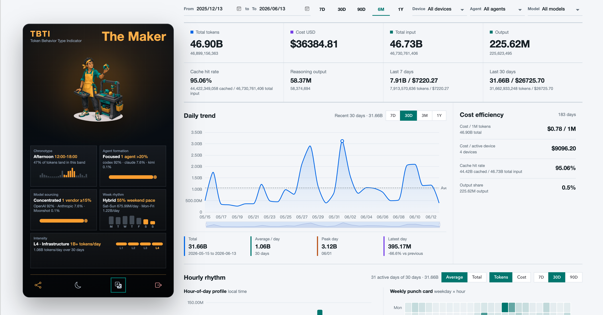

[](https://tokenflow.renaissancemind.ai/)

**Язык:** [English](../../README.md) | [简体中文](README.zh-CN.md) | [繁體中文](README.zh-TW.md) | [日本語](README.ja.md) | [한국어](README.ko.md) | [Español](README.es.md) | [Türkçe](README.tr.md) | Русский

> Local-first учет token usage для AI agents, которыми вы действительно пользуетесь.


[Возможности](#возможности) - [Установка](#установка) - [Быстрый старт](#быстрый-старт) - [Команды](#команды) - [Конфигурация](#конфигурация) - [Разработка](#разработка)

TokenFlow — устанавливаемый локальный collector для учета usage AI agents на нескольких устройствах. Он сканирует локальные данные Codex, Claude Code, Gemini CLI, OpenCode, Kimi CLI, Qwen Code, Amp, Codebuff, Droid, Goose, Hermes, Kilo, OpenClaw, and Pi, агрегирует token counts в UTC half-hour buckets по agent и model, рассчитывает известные costs и загружает на TokenFlow server только usage metadata.

Prompts и ответы остаются на вашей машине. Загружаемый payload содержит только счетчики, имена моделей, timestamps buckets, pricing status и необязательные device metadata.

## Превью

```bash
$ tokenflow status
TokenFlow status
Config: /Users/alice/.tokenflow/config.json
Server: https://tokenflow.renaissancemind.ai
Device: dev_...
Token: set (device)
Remote: linked
Local events: 1842
Local buckets: 37
Source codex: found (219 files) /Users/alice/.codex/sessions
Source claude: found (64 files) /Users/alice/.claude/projects
Source gemini: missing (0 files) /Users/alice/.gemini/tmp
Source opencode: found (1 files) /Users/alice/.local/share/opencode/opencode.db
Home: /Users/alice/.tokenflow
```

## Возможности

- 🔐 **Local-first сбор** - читает agent logs локально и загружает только metadata.
- 🤖 **Поддержка нескольких agents** - Codex, Claude Code, Gemini CLI, OpenCode, Kimi CLI, Qwen Code, Amp, Codebuff, Droid, Goose, Hermes, Kilo, OpenClaw, and Pi.
- 📊 **UTC half-hour buckets** - сохраняет локальную детализацию, а dashboards могут суммировать usage по дням.
- 💸 **Cost-aware учет** - разделяет fresh input, cached input, cache creation, output и reasoning output tokens.
- 🧾 **Видимость моделей без цены** - неизвестные модели учитываются и помечаются как `unpriced`.
- 🔁 **Автоматическая синхронизация** - устанавливает 10-минутный job через macOS `launchd` или Linux systemd user timers.
- 🔑 **Device login или API key upload** - поддерживает browser device linking и `read_write` API tokens.
- 🛠️ **Удобно для self-hosting** - можно указать любой совместимый TokenFlow server URL.

## Поддерживаемые источники

| Источник | Локальные данные | Примечания |
| --- | --- | --- |
| Codex | `~/.codex/sessions/**/rollout-*.jsonl` and archived session JSONL | Parses local rollout token events. |
| Claude Code | `~/.claude/projects/**/*.jsonl` | Parses project JSONL usage data. |
| Gemini CLI | `~/.gemini/tmp/**/chats/session-*.json` | Parses Gemini session JSON files. |
| OpenCode | `~/.local/share/opencode/opencode.db` | Requires `sqlite3` on `PATH`. |
| Kimi CLI | `~/.kimi/sessions/*/*/wire.jsonl` | Reads `StatusUpdate.token_usage` rows and `~/.kimi/config.json` model metadata. |
| Qwen Code | `~/.qwen/projects/*/chats/*.jsonl` | Reads assistant `usageMetadata` rows. |
| Amp | `~/.local/share/amp/threads/*.json` | Reads `usageLedger.events[]` or assistant `messages[].usage`. |
| Codebuff | `~/.config/manicode*/projects/**/chat-messages.json` | Reads assistant metadata usage and run-state provider usage. |
| Droid | `~/.factory/sessions/**/*.settings.json` | Reads session token snapshots and keeps the latest snapshot per session. |
| Goose | `~/.local/share/goose/sessions/sessions.db`, macOS Application Support, or Block Goose data | Requires `sqlite3` on `PATH`. |
| Hermes | `~/.hermes/state.db` | Requires `sqlite3` on `PATH`. |
| Kilo | `~/.local/share/kilo/kilo.db` | Requires `sqlite3` on `PATH`. |
| OpenClaw | `~/.openclaw`, `~/.clawdbot`, `~/.moltbot`, and `~/.moldbot` JSONL sessions | Tracks model-change rows for following assistant usage. |
| Pi | `~/.pi/agent/sessions/**/*.jsonl` | Reads assistant message usage rows. |

TokenFlow не загружает source file paths, session IDs, prompts или responses.

## Установка

TokenFlow требует Node.js 20 или новее.

```bash
npm install -g @renaissancemind/tokenflow
```

Если нужен support для OpenCode, Goose, Hermes или Kilo, убедитесь, что доступен `sqlite3`:

```bash
sqlite3 --version
```

Установка из локального checkout до публикации в npm:

```bash
npm install
npm install -g .
```

`npm install -g .` запускает package `prepare` script, поэтому TypeScript CLI компилируется до того, как npm свяжет `dist/cli.js`.

## Быстрый старт

### 1. Привяжите эту машину

```bash
tokenflow login
```

По умолчанию `login` использует `https://tokenflow.renaissancemind.ai`. Он печатает verification URL и user code, открывает браузер при возможности и сохраняет одобренный device token в `~/.tokenflow/config.json`.

Для self-hosted сервера:

```bash
tokenflow login --server-url http://127.0.0.1:8787
```

### 2. Проверьте, что будет сканироваться

```bash
tokenflow status
```

`status` показывает локальные source paths, количество parsed events, bucket counts, unpriced bucket counts, расположение config и remote auth status, если token настроен.

### 3. Синхронизируйте usage

```bash
tokenflow sync
```

`sync` сканирует локальные logs, агрегирует usage, идемпотентно загружает buckets, записывает sync heartbeat и сообщает parsed events и uploaded buckets.

### 4. Установите автоматическую синхронизацию

```bash
tokenflow init
```

`init` записывает `~/.tokenflow/config.json`, устанавливает автоматическую синхронизацию каждые 10 минут на macOS или Linux, затем запускает browser device-link flow, если token еще нет.

## Режим API Token

Browser device linking удобен для личных машин. Для серверов, CI-like машин или scripted installs создайте `read_write` API key в dashboard сервера TokenFlow:

```bash
tokenflow init --server-url https://tokenflow.renaissancemind.ai --api-token tu_api_...
```

Загружать usage могут только `read_write` keys. `read_only` keys предназначены для dashboards, API reads и public heatmap embeds; CLI отклоняет read-only keys во время `init` и `login`.

## Команды

```bash
tokenflow init --server-url https://tokenflow.renaissancemind.ai
tokenflow login --server-url https://tokenflow.renaissancemind.ai
tokenflow login --server-url https://tokenflow.renaissancemind.ai --api-token tu_api_...
tokenflow sync
tokenflow status
tokenflow update [--source @renaissancemind/tokenflow@latest|/path/to/TokenFlow]
tokenflow logout
```

| Команда | Что делает |
| --- | --- |
| `init` | Записывает config, устанавливает auto-sync и при необходимости запускает login. |
| `login` | Привязывает browser-approved device token или сохраняет validated upload API token. |
| `sync` | Парсит local usage, строит UTC half-hour buckets, загружает их и обновляет `lastSyncAt`. |
| `status` | Печатает local config, source availability, bucket counts, auth status и unpriced models. |
| `update` | Переустанавливает global package и обновляет auto-sync scheduler. |
| `logout` | Удаляет local upload tokens, сохраняя non-secret config. |

## Модель ценообразования

TokenFlow рассчитывает costs локально перед загрузкой.

- Built-in pricing covers known Codex, Claude, Gemini, OpenCode, and cc-switch-inspired third-party coding/provider model IDs including DeepSeek, Kimi K2, MiniMax, GLM, Qwen, Doubao, StepFun, MiMo, Grok, Mistral, and Cohere.
- Unknown models are still counted and uploaded with `pricing_status: "unpriced"`.
- Unpriced buckets record cost as `$0.000000` so token totals remain accurate and cost gaps stay visible.
- Cost calculation follows ccusage-style token accounting: fresh input, output, cache read, cache creation, optional 200k+ pricing tiers, and 1-hour cache creation at 2x input price when a source reports cache creation duration.
- For Codex and Gemini, cached input can be included in reported input and is separated before cost calculation to avoid double-counting.
- Kimi CLI keeps `kimi-for-coding` as the displayed model, while pricing resolves to K2.5 before `2026-04-20T15:28:10.072Z` and K2.6 after that cutoff, matching ccusage's documented mapping.

## Конфигурация

Environment overrides:

| Variable | Purpose |
| --- | --- |
| `TOKENFLOW_HOME` | Local state directory. Defaults to `~/.tokenflow`. |
| `TOKENFLOW_SERVER_URL` | Default server URL. |
| `TOKENFLOW_AUTO_SYNC_COMMAND` | Command written into launchd/systemd. Defaults to `tokenflow sync --auto`. |
| `TOKENFLOW_SYNC_MAX_BUCKETS` | Maximum changed buckets uploaded per sync. Defaults to `60` to keep first-time backfills Cloudflare-friendly. |
| `TOKENFLOW_REQUEST_TIMEOUT_MS` | HTTP request timeout for TokenFlow server calls. Defaults to `30000`. |
| `TOKENFLOW_UPDATE_SOURCE` | Package/source used by `tokenflow update` when `--source` is omitted. |
| `CODEX_HOME` | Codex config home. Defaults to `~/.codex`. |
| `CLAUDE_HOME` | Claude config home. Defaults to `~/.claude`. |
| `GEMINI_HOME` | Gemini config home. Defaults to `~/.gemini`. |
| `OPENCODE_DB` | Explicit OpenCode SQLite database path. |
| `OPENCODE_HOME` | OpenCode data home. Defaults to `~/.local/share/opencode`. |
| `KIMI_DATA_DIR` | Kimi data root, or comma-separated roots. Defaults to `~/.kimi`. |
| `QWEN_DATA_DIR` | Qwen data root, or comma-separated roots. Defaults to `~/.qwen`. |
| `AMP_DATA_DIR` | Amp data root, or comma-separated roots. Defaults to `~/.local/share/amp`. |
| `CODEBUFF_DATA_DIR` | Codebuff/Manicode data root or `projects` root, comma-separated. Defaults to `~/.config/manicode`, `~/.config/manicode-dev`, and `~/.config/manicode-staging`. |
| `DROID_SESSIONS_DIR` | Droid sessions root, or comma-separated roots. Defaults to `~/.factory/sessions`. |
| `GOOSE_PATH_ROOT` | Goose root used to resolve `data/sessions/sessions.db`. |
| `HERMES_HOME` | Hermes home, or comma-separated homes. Defaults to `~/.hermes`. |
| `KILO_DATA_DIR` | Kilo data root, or comma-separated roots. Defaults to `~/.local/share/kilo`. |
| `OPENCLAW_DIR` | OpenClaw-compatible roots, comma-separated. Defaults to `~/.openclaw`, `~/.clawdbot`, `~/.moltbot`, and `~/.moldbot`. |
| `PI_AGENT_DIR` | Pi agent sessions root, or comma-separated roots. Defaults to `~/.pi/agent/sessions`. |
| `XDG_DATA_HOME` | Used to resolve OpenCode data when `OPENCODE_DB` and `OPENCODE_HOME` are unset. |

### Локальный checkout для auto-sync

До публикации в npm можно закрепить scheduler за этим checkout:

```bash
TOKENFLOW_AUTO_SYNC_COMMAND="node /Users/chunqiu/Documents/workspace/TokenFlow/dist/cli.js sync --auto" \
  tokenflow init --server-url https://tokenflow.renaissancemind.ai
```

После публикации default scheduler command может использовать npm:

```bash
npx --yes @renaissancemind/tokenflow init --server-url https://tokenflow.renaissancemind.ai
```

## Разработка

```bash
npm install
npm test
npm run typecheck
npm run build
node dist/cli.js status
```

Source code — небольшой TypeScript CLI:

- `src/cli.ts` - command routing и user-facing behavior.
- `src/file-scan.ts` - local agent discovery и parsing entrypoint.
- `src/sources/*` - source-specific parsers.
- `src/usage-buckets.ts` - UTC bucket aggregation.
- `src/pricing.ts` - pricing resolution и cost calculation.
- `src/api.ts` - device flow, token validation и ingest calls.
- `src/scheduler.ts` - установка macOS launchd и Linux systemd timer.

## Ограничения

- OpenCode, Goose, Hermes, and Kilo database reads require the `sqlite3` CLI.
- Qoder is not currently treated as a token source because ccusage has no Qoder adapter and public Qoder APIs expose credits/usage events rather than local input/output/cache token logs.
- Автоматическая синхронизация устанавливается только на macOS и Linux; на других платформах можно запускать `tokenflow sync` вручную или подключить свой scheduler.
- Стоимость неизвестных model IDs помечается как `unpriced`, пока не появится pricing rule.

## Документация

Этот README является основной пользовательской документацией для CLI. Детали реализации можно начать изучать с focused tests в `test/` и TypeScript modules в `src/`.

## Вклад

Issues и pull requests приветствуются. Для изменений parser, pricing, scheduler или command behavior добавляйте focused test.

## Лицензия

В этом репозитории сейчас нет license file.
