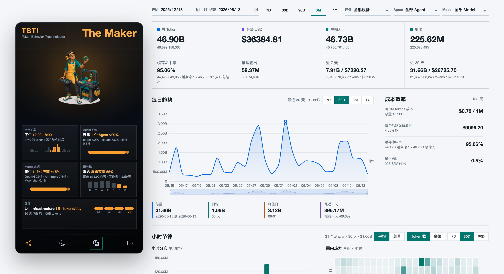

[](https://tokenflow.renaissancemind.ai/)

**语言:** [English](../../README.md) | 简体中文 | [繁體中文](README.zh-TW.md) | [日本語](README.ja.md) | [한국어](README.ko.md) | [Español](README.es.md) | [Türkçe](README.tr.md) | [Русский](README.ru.md)

> 面向真实 AI Agent 工作流的本地优先 token 统计工具。


[功能](#功能) - [安装](#安装) - [快速开始](#快速开始) - [命令](#命令) - [配置](#配置) - [开发](#开发)

TokenFlow 是一个可安装的本地采集器，用于统计多设备 AI Agent 的 token 使用量。它会扫描本地 Codex、Claude Code、Gemini CLI、OpenCode、Kimi CLI、Qwen Code、Amp、Codebuff、Droid、Goose、Hermes、Kilo、OpenClaw 和 Pi 使用数据，按 UTC 半小时 bucket、Agent 和模型聚合 token 数量，计算已知模型成本，并只把使用元数据上传到 TokenFlow 服务器。

提示词和回复内容会留在你的机器上。上传的数据只包含计数、模型名、bucket 时间戳、计价状态，以及可选的设备元数据。

## 预览

```bash
$ tokenflow status
TokenFlow status
Config: /Users/alice/.tokenflow/config.json
Server: https://tokenflow.renaissancemind.ai
Device: dev_...
Token: set (device)
Remote: linked
Local events: 1842
Local buckets: 37
Source codex: found (219 files) /Users/alice/.codex/sessions
Source claude: found (64 files) /Users/alice/.claude/projects
Source gemini: missing (0 files) /Users/alice/.gemini/tmp
Source opencode: found (1 files) /Users/alice/.local/share/opencode/opencode.db
Home: /Users/alice/.tokenflow
```

## 功能

- 🔐 **本地优先采集** - 在本机读取 Agent 日志，只上传元数据。
- 🤖 **多 Agent 支持** - 支持 Codex、Claude Code、Gemini CLI、OpenCode、Kimi CLI、Qwen Code、Amp、Codebuff、Droid、Goose、Hermes、Kilo、OpenClaw 和 Pi。
- 📊 **UTC 半小时 bucket** - 保留本地使用细节，同时 dashboard 仍可按天汇总。
- 💸 **成本感知统计** - 区分 fresh input、cached input、cache creation、output 和 reasoning output tokens。
- 🧾 **未计价模型可见** - 未知模型仍然计入 token，并标记为 `unpriced`。
- 🔁 **自动同步** - 在 macOS `launchd` 或 Linux systemd user timer 中安装 10 分钟同步任务。
- 🔑 **设备登录或 API key 上传** - 支持浏览器设备授权和 `read_write` API token。
- 🛠️ **适合自托管** - 可以指向任意兼容的 TokenFlow server URL。

## 支持的数据源

| 来源 | 读取的本地数据 | 说明 |
| --- | --- | --- |
| Codex | `~/.codex/sessions/**/rollout-*.jsonl` 和 archived session JSONL | 解析本地 rollout token 事件。 |
| Claude Code | `~/.claude/projects/**/*.jsonl` | 解析项目 JSONL 使用数据。 |
| Gemini CLI | `~/.gemini/tmp/**/chats/session-*.json` | 解析 Gemini session JSON 文件。 |
| OpenCode | `~/.local/share/opencode/opencode.db` | 需要 `PATH` 中存在 `sqlite3`。 |
| Kimi CLI | `~/.kimi/sessions/*/*/wire.jsonl` | 读取 `StatusUpdate.token_usage` 行和 `~/.kimi/config.json` 模型元数据。 |
| Qwen Code | `~/.qwen/projects/*/chats/*.jsonl` | 读取 assistant `usageMetadata` 行。 |
| Amp | `~/.local/share/amp/threads/*.json` | 读取 `usageLedger.events[]` 或 assistant `messages[].usage`。 |
| Codebuff | `~/.config/manicode*/projects/**/chat-messages.json` | 读取 assistant metadata usage 和 run-state provider usage。 |
| Droid | `~/.factory/sessions/**/*.settings.json` | 读取 session token snapshot，并保留每个 session 的最新 snapshot。 |
| Goose | `~/.local/share/goose/sessions/sessions.db`、macOS Application Support 或 Block Goose 数据 | 需要 `PATH` 中存在 `sqlite3`。 |
| Hermes | `~/.hermes/state.db` | 需要 `PATH` 中存在 `sqlite3`。 |
| Kilo | `~/.local/share/kilo/kilo.db` | 需要 `PATH` 中存在 `sqlite3`。 |
| OpenClaw | `~/.openclaw`、`~/.clawdbot`、`~/.moltbot` 和 `~/.moldbot` JSONL sessions | 跟踪 model-change 行并关联后续 assistant usage。 |
| Pi | `~/.pi/agent/sessions/**/*.jsonl` | 读取 assistant message usage 行。 |

TokenFlow 不会上传源文件路径、session ID、提示词或回复内容。

## 安装

TokenFlow 需要 Node.js 20 或更高版本。

```bash
npm install -g @renaissancemind/tokenflow
```

如果需要 OpenCode、Goose、Hermes 或 Kilo 支持，请确认 `sqlite3` 可用：

```bash
sqlite3 --version
```

在 npm 发布前从本地 checkout 安装：

```bash
npm install
npm install -g .
```

`npm install -g .` 会运行 package 的 `prepare` 脚本，因此会先编译 TypeScript CLI，再把 `dist/cli.js` 链接为全局命令。

## 快速开始

### 1. 关联这台机器

```bash
tokenflow login
```

默认情况下，`login` 使用 `https://tokenflow.renaissancemind.ai`。它会打印 verification URL 和 user code，在可能时打开浏览器，并把授权后的 device token 保存到 `~/.tokenflow/config.json`。

使用自托管服务器：

```bash
tokenflow login --server-url http://127.0.0.1:8787
```

### 2. 查看会扫描哪些数据

```bash
tokenflow status
```

`status` 会显示本地 source 路径、解析到的 event 数量、bucket 数量、未计价 bucket 数量、配置文件位置，以及已配置 token 时的远端认证状态。

### 3. 同步使用量

```bash
tokenflow sync
```

`sync` 会扫描本地日志、聚合使用量、幂等上传 bucket、记录同步心跳，并报告解析到的 events 和上传的 buckets。

### 4. 安装自动同步

```bash
tokenflow init
```

`init` 会写入 `~/.tokenflow/config.json`，在 macOS 或 Linux 上安装每 10 分钟运行一次的自动同步任务，然后在没有 token 时启动浏览器设备授权流程。

## API Token 模式

浏览器设备授权适合个人机器。对于服务器、类 CI 机器或脚本化安装，可以在 TokenFlow server dashboard 中创建 `read_write` API key：

```bash
tokenflow init --server-url https://tokenflow.renaissancemind.ai --api-token tu_api_...
```

只有 `read_write` key 可以上传使用量。`read_only` key 用于 dashboard、API 读取和公开 heatmap embed；CLI 会在 `init` 和 `login` 阶段拒绝 read-only key。

## 命令

```bash
tokenflow init --server-url https://tokenflow.renaissancemind.ai
tokenflow login --server-url https://tokenflow.renaissancemind.ai
tokenflow login --server-url https://tokenflow.renaissancemind.ai --api-token tu_api_...
tokenflow sync
tokenflow status
tokenflow update [--source @renaissancemind/tokenflow@latest|/path/to/TokenFlow]
tokenflow logout
```

| 命令 | 作用 |
| --- | --- |
| `init` | 写入配置、安装自动同步，并可选启动登录。 |
| `login` | 关联浏览器授权的 device token，或保存已验证的 upload API token。 |
| `sync` | 解析本地使用量，构建 UTC 半小时 bucket，上传并更新 `lastSyncAt`。 |
| `status` | 打印本地配置、source 可用性、bucket 数量、认证状态和未计价模型。 |
| `update` | 重新安装全局包并刷新自动同步调度器。 |
| `logout` | 移除本地上传 token，同时保留非密钥配置。 |

## 计价模型

TokenFlow 会在上传前本地计算成本。

- 内置计价覆盖已知 Codex、Claude、Gemini、OpenCode，以及参考 cc-switch 的第三方 coding/provider 模型 ID，包括 DeepSeek、Kimi K2、MiniMax、GLM、Qwen、Doubao、StepFun、MiMo、Grok、Mistral 和 Cohere。
- 未知模型仍会被统计并以 `pricing_status: "unpriced"` 上传。
- 未计价 bucket 的成本记录为 `$0.000000`，这样 token 总量保持准确，成本缺口也保持可见。
- 成本计算遵循 ccusage 风格的 token 统计：fresh input、output、cache read、cache creation、可选 200k+ 计价层，以及来源上报 cache creation duration 时的 1 小时 cache creation 2x input 价格。
- 对 Codex 和 Gemini，cached input 可能包含在 reported input 中，并会在成本计算前拆分出来，避免重复计费。
- Kimi CLI 展示模型保持为 `kimi-for-coding`；计价会在 `2026-04-20T15:28:10.072Z` 前解析到 K2.5，之后解析到 K2.6，与 ccusage 的映射一致。

## 配置

环境变量覆盖项：

| 变量 | 用途 |
| --- | --- |
| `TOKENFLOW_HOME` | 本地状态目录。默认 `~/.tokenflow`。 |
| `TOKENFLOW_SERVER_URL` | 默认服务器 URL。 |
| `TOKENFLOW_AUTO_SYNC_COMMAND` | 写入 launchd/systemd 的命令。默认 `tokenflow sync --auto`。 |
| `TOKENFLOW_SYNC_MAX_BUCKETS` | 每次 sync 上传的最大变更 bucket 数。默认 `60`，让首次回填更适合 Cloudflare。 |
| `TOKENFLOW_REQUEST_TIMEOUT_MS` | TokenFlow server HTTP 请求超时。默认 `30000`。 |
| `TOKENFLOW_UPDATE_SOURCE` | `tokenflow update` 未传 `--source` 时使用的 package/source。 |
| `CODEX_HOME` | Codex 配置目录。默认 `~/.codex`。 |
| `CLAUDE_HOME` | Claude 配置目录。默认 `~/.claude`。 |
| `GEMINI_HOME` | Gemini 配置目录。默认 `~/.gemini`。 |
| `OPENCODE_DB` | 显式 OpenCode SQLite 数据库路径。 |
| `OPENCODE_HOME` | OpenCode 数据目录。默认 `~/.local/share/opencode`。 |
| `KIMI_DATA_DIR` | Kimi 数据根目录，或逗号分隔的多个根目录。默认 `~/.kimi`。 |
| `QWEN_DATA_DIR` | Qwen 数据根目录，或逗号分隔的多个根目录。默认 `~/.qwen`。 |
| `AMP_DATA_DIR` | Amp 数据根目录，或逗号分隔的多个根目录。默认 `~/.local/share/amp`。 |
| `CODEBUFF_DATA_DIR` | Codebuff/Manicode 数据根目录或 `projects` 根目录，可用逗号分隔。默认 `~/.config/manicode`、`~/.config/manicode-dev` 和 `~/.config/manicode-staging`。 |
| `DROID_SESSIONS_DIR` | Droid sessions 根目录，或逗号分隔的多个根目录。默认 `~/.factory/sessions`。 |
| `GOOSE_PATH_ROOT` | Goose root，用于解析 `data/sessions/sessions.db`。 |
| `HERMES_HOME` | Hermes home，或逗号分隔的多个 home。默认 `~/.hermes`。 |
| `KILO_DATA_DIR` | Kilo 数据根目录，或逗号分隔的多个根目录。默认 `~/.local/share/kilo`。 |
| `OPENCLAW_DIR` | OpenClaw 兼容根目录，可用逗号分隔。默认 `~/.openclaw`、`~/.clawdbot`、`~/.moltbot` 和 `~/.moldbot`。 |
| `PI_AGENT_DIR` | Pi agent sessions 根目录，或逗号分隔的多个根目录。默认 `~/.pi/agent/sessions`。 |
| `XDG_DATA_HOME` | 未设置 `OPENCODE_DB` 和 `OPENCODE_HOME` 时用于解析 OpenCode 数据目录。 |

### 自动同步使用本地 checkout

npm 发布前，可以让调度器固定运行这个 checkout：

```bash
TOKENFLOW_AUTO_SYNC_COMMAND="node /Users/chunqiu/Documents/workspace/TokenFlow/dist/cli.js sync --auto" \
  tokenflow init --server-url https://tokenflow.renaissancemind.ai
```

发布后，默认调度命令可以直接使用 npm：

```bash
npx --yes @renaissancemind/tokenflow init --server-url https://tokenflow.renaissancemind.ai
```

## 开发

```bash
npm install
npm test
npm run typecheck
npm run build
node dist/cli.js status
```

源码是一个小型 TypeScript CLI：

- `src/cli.ts` - 命令路由和面向用户的行为。
- `src/file-scan.ts` - 本地 Agent 发现和解析入口。
- `src/sources/*` - 各 source 专用 parser。
- `src/usage-buckets.ts` - UTC bucket 聚合。
- `src/pricing.ts` - 计价解析和成本计算。
- `src/api.ts` - 设备授权、token 验证和 ingest 调用。
- `src/scheduler.ts` - macOS launchd 和 Linux systemd timer 安装。

## 限制

- OpenCode、Goose、Hermes 和 Kilo 数据库读取需要 `sqlite3` CLI。
- Qoder 目前不会作为 token source 处理，因为 ccusage 没有 Qoder adapter，公开 Qoder API 暴露的是 credits/usage events，而不是本地 input/output/cache token 日志。
- 自动同步只在 macOS 和 Linux 上安装；其他平台可以手动运行 `tokenflow sync` 或自行接入调度器。
- 未知模型 ID 的成本会标记为 `unpriced`，直到存在对应计价规则。

## 文档

这个 README 是 CLI 的主要用户文档。实现细节可以从 `test/` 中的聚焦测试和 `src/` 中的 TypeScript 模块开始阅读。

## 贡献

欢迎提交 issue 和 pull request。涉及 parser、pricing、scheduler 或 command 行为的修改，请附带聚焦测试。

## 许可证

当前仓库尚未包含 license 文件。
